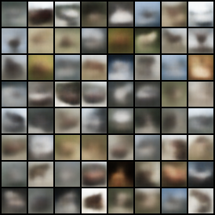
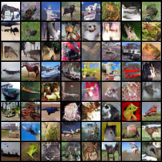
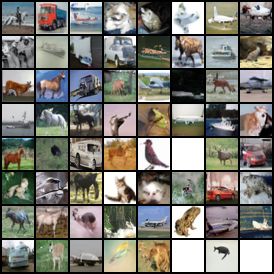
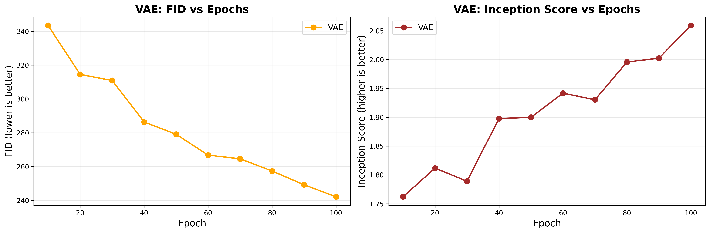
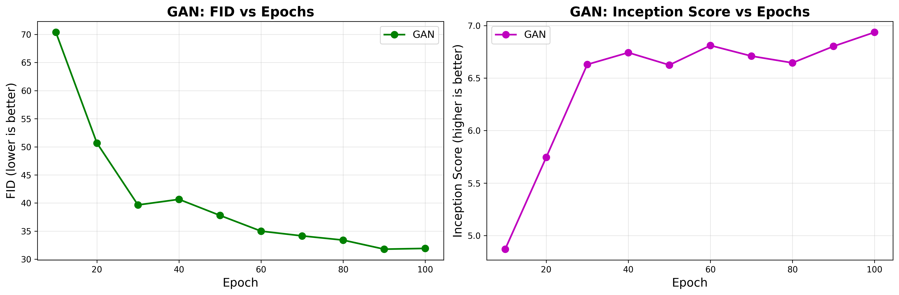
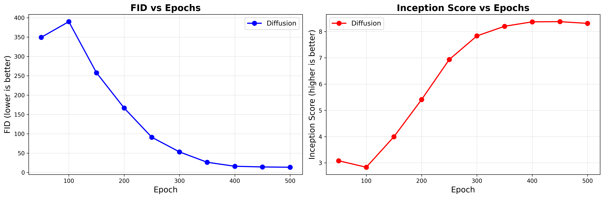

# Image Generation Comparison: VAE · GAN · Diffusion

> Comparing three generative model families on **CIFAR-10** (32×32 RGB images).  

---

## Results at a Glance

| Model | Epochs | Best FID ↓ | Best IS ↑ | Training time |
|-------|:------:|:----------:|:---------:|:-------------:|
| VAE   | 100    | 242.15     | 2.06      | ~2 h (A100)   |
| GAN (DCGAN) | 100 | **31.93** | 6.94   | ~1.5 h (A100) |
| Diffusion (DDPM) | 500 | **13.48** | **8.31** | ~18 h (A100) |

> FID: lower is better
> IS: higher is better 

---

## Sample Outputs

### VAE


### GAN (DCGAN)


### Diffusion (DDPM)


---

## Architecture

### VAE


**Encoder:** 4× Conv2d (k=4, s=2, p=1) → flatten → two FC heads (μ, log σ²)  
**Decoder:** FC → view → 4× ConvTranspose2d → Tanh  
**Latent dim:** 256 · **Loss:** MSE reconstruction + β-annealed KL divergence  
**Training:** 100 epochs, Adam (lr=1e-3), AMP, batch 256

---

### GAN (DCGAN)


**Generator:** z(128,1,1) → 5× ConvTranspose2d → (3,32,32) Tanh  
**Discriminator:** (3,32,32) → 4× Conv2d → scalar logit  
**Loss:** BCEWithLogitsLoss · **Training:** 100 epochs, Adam (lr=2e-4, β=0.5/0.999), AMP, batch 128

---

### Diffusion (DDPM)


**Noise schedule:** Cosine, T=1000 steps  
**Backbone:** UNet — sinusoidal time embeddings, residual blocks, multi-head self-attention, group norm  
**EMA decay:** 0.9999 · **Loss:** MSE on predicted noise  
**Training:** 500 epochs, AdamW (lr=2e-4), cosine LR schedule, batch 64

---

## Training Curves
VAE


GAN


Diffusion
 |

---

## Repo Structure

```
image-generation-comparison/
├── README.md
├── report.pdf
├── requirements.txt
├── app.py                          # Streamlit interactive demo
├── models/
│   ├── vae.py                      # VAE model, training loop, generate()
│   ├── gan.py                      # DCGAN model, training loop, generate()
│   └── diffusion.py                # DDPM UNet, schedule, EMA, generate()
├── samples/
│   ├── vae/                        # ~50 pre-generated VAE images
│   ├── gan/                        # ~50 pre-generated GAN images
│   └── diffusion/                  # ~50 pre-generated Diffusion images
└── assets/
    ├── VAE Architecture.png
    ├── GAN Architecture.png
    ├── Diffusion Model Architecture.png
    └── evaluation_graphs/
        ├── vae_metrics.csv
        ├── gan_metrics.csv
        ├── diffusion_metrics.csv
        ├── vae_metrics_vs_epochs.png
        ├── gan_metrics_vs_epochs.png
        └── diffusion_metrics_vs_epochs.png
```

---

## Quickstart

### 1. Install dependencies

```bash
pip install -r requirements.txt
```

> GPU strongly recommended. Tested on Python 3.10+, PyTorch 2.1, CUDA 12.1.

### 2. Run the Streamlit demo

```bash
streamlit run app.py
```

Browse pre-generated samples, compare FID/IS curves, and view architecture diagrams interactively.

### 3. Train from scratch

Each model module is self-contained and runnable:

```python
# VAE
from models.vae import train as train_vae
train_vae()  # saves checkpoints + samples to ./outputs/vae/

# GAN
from models.gan import train as train_gan
train_gan()  # saves checkpoints + samples to ./outputs/gan/

# Diffusion (slow — GPU required)
from models.diffusion import train as train_diffusion
train_diffusion()  # saves checkpoints every 50 epochs to ./outputs/diffusion/
```

### 4. Generate from a saved checkpoint

```python
from models.vae       import generate as vae_generate
from models.gan       import generate as gan_generate
from models.diffusion import generate as diff_generate

vae_generate("outputs/vae/vae_epoch_100.pth",           n=64, out_path="vae_grid.png")
gan_generate("outputs/gan/dcgan_epoch_100.pth",         n=64, out_path="gan_grid.png")
diff_generate("outputs/diffusion/diffusion_epoch_500.pth", n=16, out_path="diff_grid.png")
```

---

## Key Findings

- **Diffusion** achieves the best sample quality (FID 13.48, IS 8.31) after 500 epochs, but is
  ~12× slower to train than the GAN.
- **GAN** reaches competitive FID (31.93) in only 100 epochs — the best quality-to-training-time
  trade-off.
- **VAE** produces blurry images (FID 242) due to the pixel-level MSE objective averaging over
  the posterior; IS barely exceeds 2 even at epoch 100.
- EMA weights in the diffusion model provided noticeably sharper samples than the raw model weights.

---
